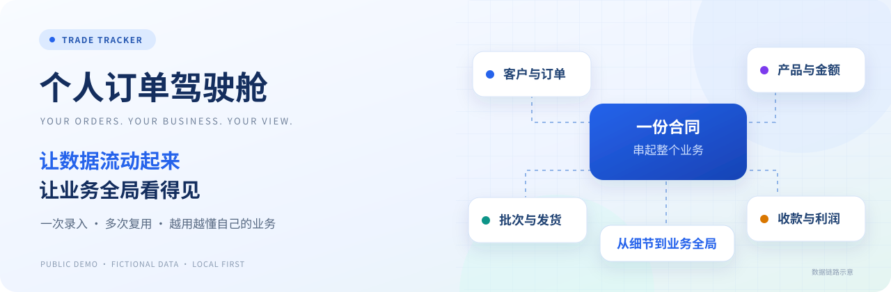
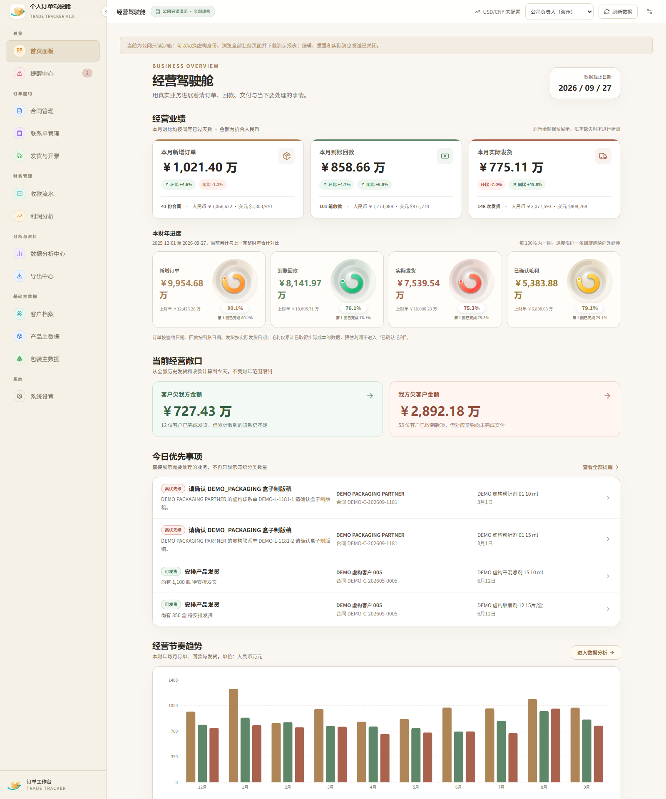
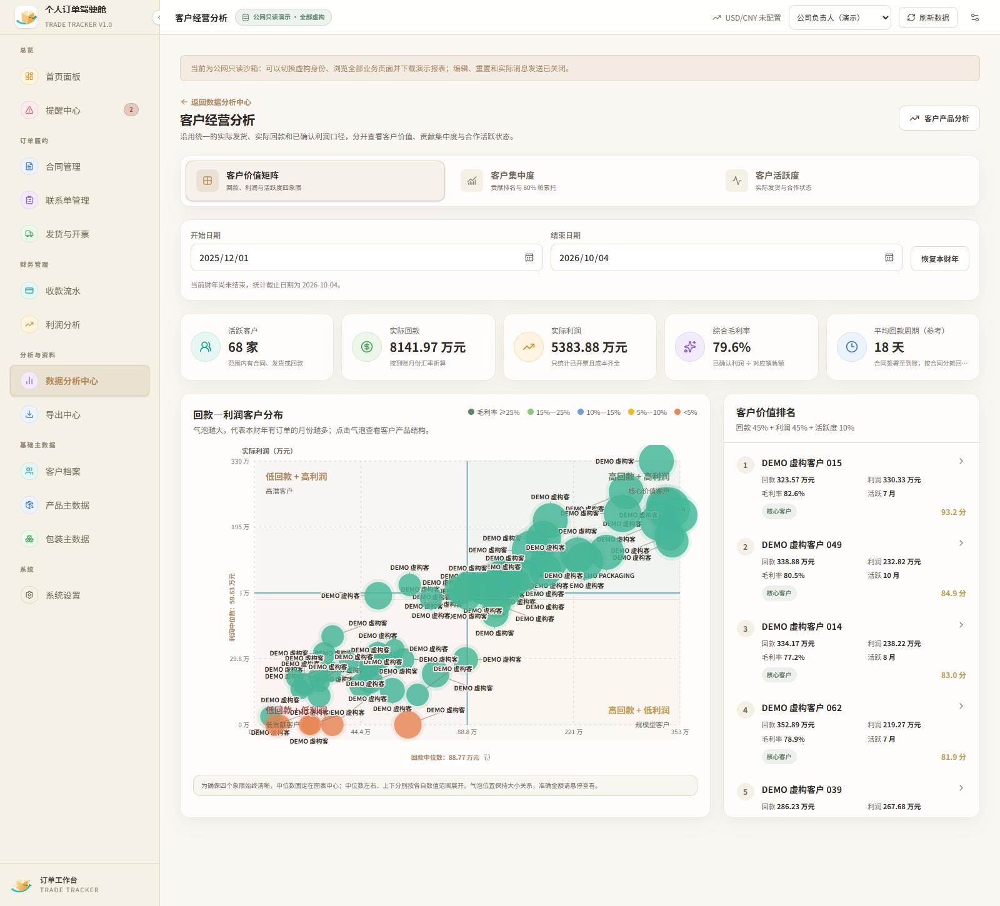
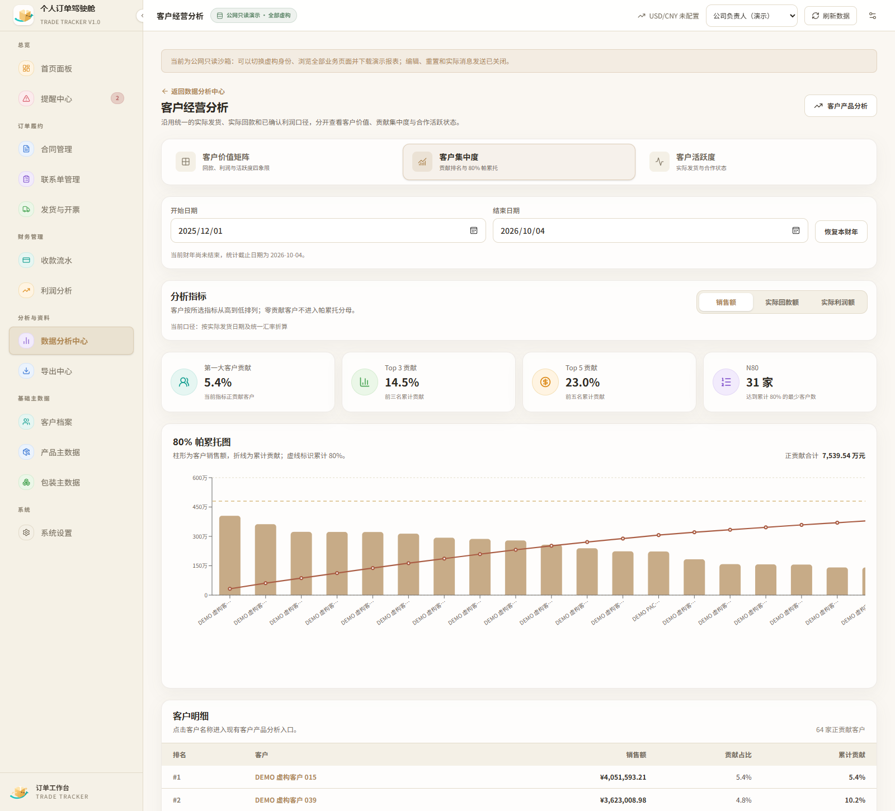
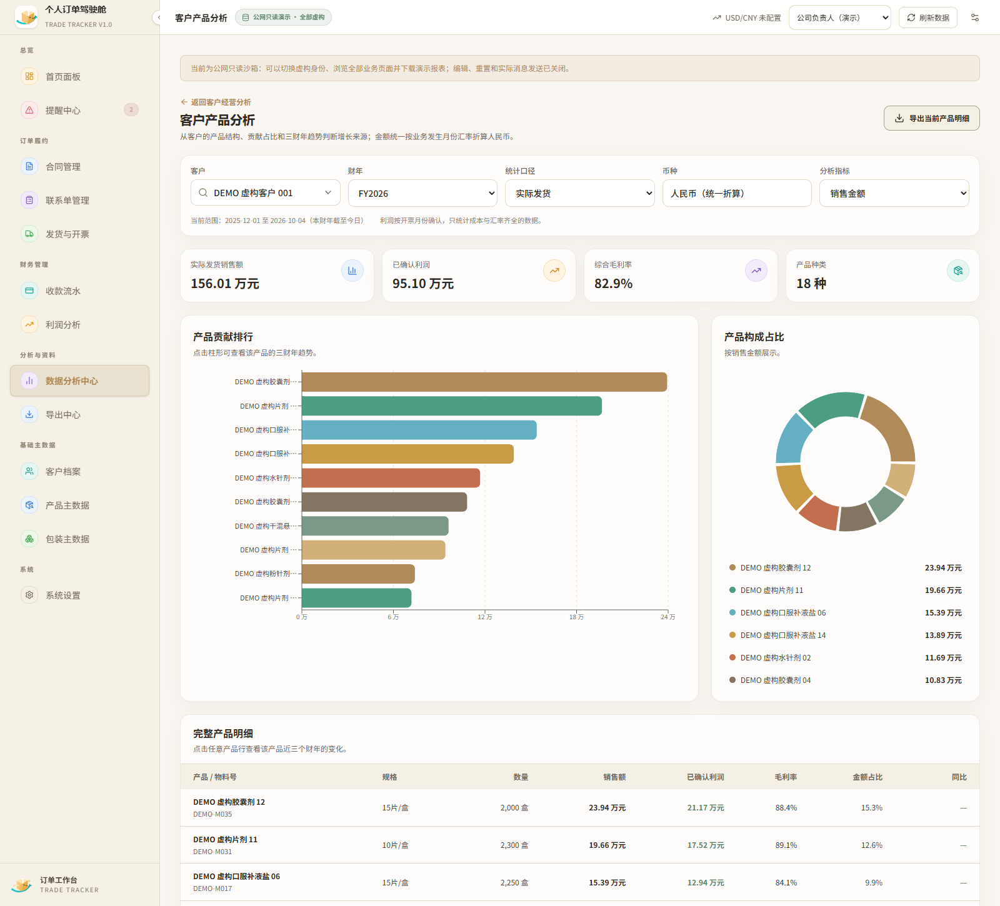
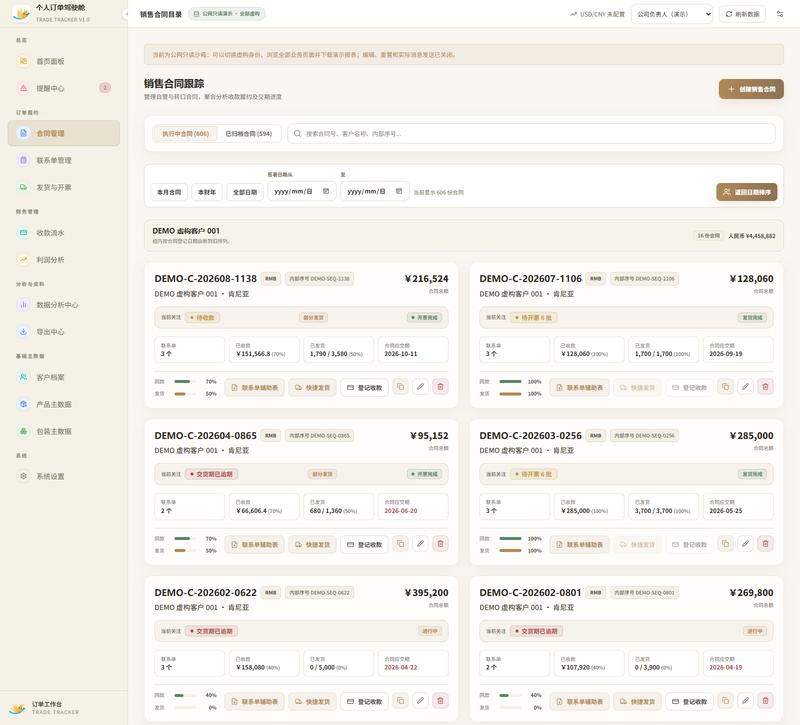
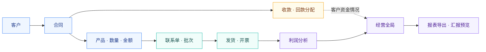

<div align="center">


<h1>个人订单驾驶舱</h1>
<p><strong>告别反复填表 · 打通订单全链路 · 看清自己的业务全局</strong></p>
<p>TRADE TRACKER · 从跟进订单，到理解业务</p>

<p><a href="https://deskdemo.jedliuai.com"></a>  </p>

</div>

## 🚀 在线体验 · 无需安装

| 🌐 体验网址 | 👤 体验账号 | 🔑 体验密码 |
| :---: | :---: | :---: |
| **[https://deskdemo.jedliuai.com](https://deskdemo.jedliuai.com)** | **`test`** | **`test123456`** |

> [!TIP]
> **点击上方网址，登录就能体验。** 建议从首页开始，再看合同、发货与开票、收款流水和数据分析中心；也可以切换业务员、经理、老板身份，换个视角看同一套虚构业务。
>
> 公网提供只读浏览、身份切换、汇报预览和样例报表下载；想体验新增、编辑等完整操作，可以运行下方的本地版本。

<div align="center">

</div>

<p align="center">
    
</p>

<p align="center">
<a href="#about">项目简介</a> · <a href="#why">为什么做</a> · <a href="#showcase">界面预览</a> · <a href="#features">功能一览</a> · <a href="#quick-start">本地运行</a> · <a href="#development">开发与部署</a>
</p>

---

<a id="about"></a>

## ✨ About · 项目简介

**个人订单驾驶舱**，是面向工厂外贸业务员，以及外贸公司老板、业务人员的订单管理与经营分析项目。

把客户、合同、产品、数量、金额、发货、收款和利润串起来，让一笔订单从签订到履约、从回款到利润，都能沿着关联记录追踪。日常跟进有依据，经营分析有全局，需要报表时也能直接复用已录入的信息。

本仓库提供可在本机完整运行的演示版本，以及一个无需安装的 Cloudflare 公网只读体验站。预置公司、客户、人员、合同和交易均为虚构演示数据。

> **订单走到哪了？钱回来了吗？这笔业务赚了多少？**
>
> 打开驾驶舱，从一笔订单的细节，到整个业务的变化，都能找到对应的记录和视角。

<a id="why"></a>

## 💡 为什么做这个项目

### 01 · 告别散落在无数 Excel 里的业务数据

帮助工厂基层外贸业务员，以及外贸公司的老板、业务人员，告别业务数据在无数 Excel 之间反复填写、来回复制，数据无法打通、散落各处，对自己的业务缺乏大局观的痛苦。

**同一份信息，不必再在不同的表格里反复整理。** 客户、合同、订单进展和财务记录有了共同的关联，查找与跟进也就有了清晰的入口。

### 02 · 一次录入，长期保存，多次复用

实现订单、合同信息一次录入、长期保存、多次复用，打通 **客户 → 合同 → 产品 → 数量 → 金额 → 发货 → 收款 → 利润** 之间的壁垒，让数据真正流动起来。

合同与产品信息沿关联复用，发货、开票、到账等实际进展持续记录；这些记录又成为首页指标、经营分析、常用报表和汇报摘要的共同依据。

### 03 · 数据越积越多，你会越来越了解自己的业务

随着时间推移和数据累积，你会从越来越多的角度了解自己的业务：**客户角度、产品角度、时间维度（年、月）、趋势分析**。

从微观细节到宏观全局，都能逐步看得更清楚；即便是一线业务人员，也能拥有领导看业务时的大局观。

<div align="center">
<h3>让数据流动起来，让业务全局看得见。</h3>
</div>

<a id="showcase"></a>

## 🖼️ 界面预览 · 五个角度认识驾驶舱

以下截图均使用 **Microsoft Edge** 从本项目的 **公网虚构演示站** 实际截取；图中客户、产品、订单、金额均为虚构数据。点击图片可查看大图。

### ① 经营首页 · 打开就知道业务走到哪了

订单、回款、发货、财年进度与当前经营敞口集中展示，让日常跟进有一个共同的起点。

[](docs/assets/screenshots/01-dashboard.png)

### ② 客户价值矩阵 · 从一张图看清客户贡献

把回款与利润放进四象限，结合气泡大小与毛利率颜色，观察核心价值客户、高潜客户以及不同客户的贡献。

[](docs/assets/screenshots/02-customer-value-matrix.png)

<details>
<summary><strong>③ 客户集中度 · 看贡献，也看业务是否过于集中</strong></summary>

通过贡献排名与 80% 帕累托分析，观察业务依赖集中在哪些客户。

[](docs/assets/screenshots/03-customer-concentration.png)

</details>

<details>
<summary><strong>④ 客户产品分析 · 从产品结构观察业务变化</strong></summary>

观察一位客户的产品贡献排行、产品构成占比，并可进一步查看产品的三财年趋势。

[](docs/assets/screenshots/04-product-analysis.png)

</details>

<details>
<summary><strong>⑤ 合同管理 · 从全局回到一笔订单的细节</strong></summary>

合同、关联产品与履约进度集中查看，日常跟进不再靠翻找多份表格。

[](docs/assets/screenshots/05-contracts.png)

</details>

<a id="features"></a>

## 🧭 功能一览 · 从订单跟进到经营分析

| 模块 | 能做什么 | 帮你看清什么 |
| :--- | :--- | :--- |
| 🏠 **首页面板** | 订单、回款、发货、利润指标与财年进度 | 当前业务概况，以及今天优先跟进的事项 |
| 👥 **客户档案** | 客户资料、关联订单与客户分析 | 客户贡献、交易变化与往来情况 |
| 📝 **合同管理** | 合同与产品明细、联系单关联、进度追踪 | 一笔订单从哪里开始，现在走到哪一步 |
| 🏭 **联系单与批次** | 排产、入库、放行及批次跟进 | 产品履约进度与分批生产情况 |
| 🚚 **发货与开票** | 发货安排、实际发货、开票状态 | 货发了多少，哪些还需要开票 |
| 💰 **收款流水** | 到账记录、回款分配与应收跟进 | 钱回来多少，还有哪些款项待跟进 |
| 📈 **利润分析** | 按实际开票匹配成本与汇率 | 已确认利润，以及缺少计算条件的记录 |
| 🔎 **数据分析中心** | 客户、产品、年月与趋势等多维分析 | 业务变化发生在哪里，客户和产品如何贡献业绩 |
| 🔔 **提醒中心** | 汇总需要关注的业务事项 | 今天应该先处理什么 |
| 📦 **产品与包装主数据** | 产品、规格、包装资料集中维护 | 常用资料如何复用，减少重复整理 |
| 📤 **导出中心** | 十类常用 Excel / Word 报表 | 把已有记录整理成可以交付的业务资料 |
| ✉️ **Telegram 汇报** | 经营摘要预览；本地配置后手动确认发送 | 快速整理当前身份范围内的经营情况 |

### 🔗 同一条数据链，串起不同的业务视角



利润以实际开票、对应月份成本和汇率为计算依据；缺少成本或汇率时显示待计算。收款记录用于回款与客户资金分析，不直接替代利润计算依据。

### 🔭 换个角度，越来越懂自己的业务

| 观察角度 | 可以从什么问题开始 |
| :--- | :--- |
| **客户角度** | 谁带来了订单、回款和利润？客户交易变化如何？业务是否过于集中？ |
| **产品角度** | 哪些产品贡献了销量和利润？产品结构有什么变化？ |
| **时间维度** | 今年与去年、本月与上月发生了什么变化？财年进度如何？ |
| **趋势分析** | 订单、发货、回款和利润分别在怎样变化？变化集中在哪些客户或产品？ |
| **微观细节** | 某份合同、某条联系单、某个批次，目前有什么进展？ |
| **宏观全局** | 把分散记录汇总起来后，整个业务的规模、结构和节奏是什么样子？ |

顶栏提供 **三个业务员、经理、老板** 五个演示身份。业务员关注各自数据，经理和老板汇总查看；公网所有身份均为只读。

## 🌐 在线体验与本地完整演示

| 能力 | 🌐 公网只读体验 | 💻 本地完整演示 |
| :--- | :---: | :---: |
| 首页指标、关联记录、多维分析 | ✅ | ✅ |
| 五个演示身份切换 | ✅ | ✅ |
| Excel / Word 报表 | ✅ 构建时生成的样例 | ✅ 按本地记录和筛选即时生成 |
| Telegram 经营汇报预览 | ✅ | ✅ |
| 新增、修改、删除业务记录 | — | ✅ |
| SQLite 持久化、全库备份与重置 | — | ✅ |
| Telegram 实际发送 | — | ✅ 本地配置后，手动确认发送 |

公网快照由虚构种子重新生成，不读取本机 SQLite，也不连接 NAS、家庭网络或生产业务系统。

<a id="quick-start"></a>

## ⚡ 本地运行 · 两步启动

需要 **Node.js 22.12+**（本机验证使用 24）与 **Python 3.12+**。先克隆仓库并进入项目目录：

```sh
git clone https://github.com/jedliuai/trade-order-dashboard-demo.git
cd trade-order-dashboard-demo
```

安装依赖并启动：

```sh
npm run setup
npm run dev
```

使用 **Microsoft Edge** 打开 **[http://127.0.0.1:5180](http://127.0.0.1:5180)**。

`setup` 会创建项目内 `.venv` 并安装 Python、前端依赖。首次启动按当天日期生成虚构数据、初始化 SQLite，确保当前月份有可演示的订单、回款、发货和利润。安装依赖需要联网，日常浏览与编辑不需要互联网。

<details>
<summary><strong>📦 构建后运行：只启动一个本地服务</strong></summary>

```sh
npm run build
npm start
```

使用 Edge 打开 **[http://127.0.0.1:8765](http://127.0.0.1:8765)**。按 `Ctrl+C` 停止服务。

两个启动模式请勿同时运行；`8765` 和 `5180` 端口必须空闲。

</details>

## 🗂️ 数据与导出

| 内容 | 位置 | 是否进入 Git |
| :--- | :--- | :---: |
| 当前日期的虚构数据生成器 | `local_api/seed.py` | ✅ |
| 固定日期的纯虚构样例快照 | `data/demo-seed.json` | ✅ |
| 本机实际编辑后的 SQLite 数据 | `data/demo.sqlite3` | — |
| 重置前的完整 JSON 快照 | `data/backups/` | — |
| Telegram 本机配置 | `.env.local` | — |

设置页可以下载全库 JSON 备份。重置需要再次确认，会先自动保存快照，再按重置当天重新生成虚构数据库。当前没有一键导入备份按钮，删除或重建数据库前请保留备份。

**十类常用报表**使用重新生成的通用 Excel / Word 版式：

| 订单与生产 | 财务与客户 | 发货与交付 |
| :--- | :--- | :--- |
| 生产协调与催包材统计表 | 回款明细表 | 发货安排表 |
| 订单月度汇总表 | 客户实际销售、回款及应收汇总 | 收货确认函 |
| 正本合同登记统计表 | 人民币增值税开票申请表 | 全部发货明细 |
| 下联系单辅助表 | | |

<details>
<summary><strong>✉️ 配置 Telegram：先预览，再确认发送</strong></summary>

复制 `.env.local.example` 为 `.env.local`，在本机填写测试 Bot Token、经理与老板的接收人 Chat ID。真实密钥和接收人配置不得提交 Git。

未配置时可以预览本月、上月、财年的汇报，不能发送。配置后，仍需要在设置页明确点击并确认才发送；Bot 需已获接收人或群组允许发送消息。

汇报只包含当前演示身份范围内的统计摘要，不会定时推送、不会自动同步，也不支持浏览器指定任意接收人。公网始终只允许预览。

</details>

<a id="development"></a>

## 🛠️ 开发与部署

| 层级 | 技术与职责 |
| :--- | :--- |
| **前端** | React、TypeScript、Vite、Tailwind CSS、Recharts |
| **本地服务** | Python 标准库 HTTP 服务、SQLite 持久化 |
| **报表生成** | openpyxl、python-docx |
| **公网体验** | Cloudflare Worker、构建期虚构快照、静态资源 |

```text
trade-order-dashboard-demo/
├── frontend/        # 界面、图表与前端业务逻辑
├── local_api/       # 本地接口、SQLite、虚构数据与报表生成
├── cloudflare/      # 公网登录入口与只读路由
├── scripts/         # 安装、启动、构建与公网快照生成
├── data/            # 可提交的虚构种子；运行库与备份被忽略
├── docs/            # 项目说明、介绍文案与本轮演示截图
└── worklog/         # 每轮完整更新的中文工作记录
```

项目已有检查命令：

```sh
npm test
npm run lint
npm run build
```

<details>
<summary><strong>☁️ Cloudflare 公网只读版本的构建与部署</strong></summary>

首次部署前，在项目根目录安装 Wrangler 等开发依赖：

```sh
npm ci
```

准备自己的 Cloudflare 账号、域名和 Worker Secret，修改 `wrangler.jsonc` 中的 Worker 名称与自定义域名，再执行：

```sh
npm run build:cloudflare
npm run check:cloudflare
npm run deploy:cloudflare
```

`build:cloudflare` 按上海时区当天日期重新生成公网快照和样例报表，再构建前端。公网运行 Worker 与静态资源，不运行 Python / SQLite。新增、修改、删除、全库备份、重置和 Telegram 实际发送均由 Worker 拒绝。

`DEMO_PASSWORD` 与 `AUTH_SECRET` 必须用 Wrangler Secret 配置，不能写入源码、配置或提交历史。上方公开体验账号仅用于本项目的只读演示站。

生成目录 `frontend/public/.cloudflare-demo/`、`frontend/dist/` 和本机配置均不进入 Git。公网构建始终从虚构种子生成，不读取 `data/demo.sqlite3`。

</details>

<details>
<summary><strong>📌 演示范围与已有业务口径</strong></summary>

所有预置业务数据均为虚构内容，请勿录入真实客户或业务数据。公开共享账号与顶栏身份切换用于演示，不提供生产级认证。

本地服务只绑定 `127.0.0.1`，不要代理到公网或局域网。全库 JSON 备份与健康检查属于本机管理功能，不是按业务员隔离的生产权限接口。

财年沿用 **12 月 1 日至次年 11 月 30 日** 的口径。开票、利润、回款、归档及状态规则保留现有业务约束；缺少汇率或成本时显示待计算，不填造利润。排产日期在本地手工维护，不与生产系统同步。

本地业务数据保存在本机；主动下载导出文件或明确确认 Telegram 发送时，才按对应操作输出数据。仓库只同步源码、文档、本轮虚构演示截图和虚构种子，不同步运行数据库、备份、真实密钥或私人素材。

</details>

---

<div align="center">
<h3>少一点反复填表，多一点对业务的掌握。</h3>
<p>从一笔订单开始，逐步看清自己的整个业务。</p>
<p><a href="https://deskdemo.jedliuai.com"><strong>🚀 现在就去体验个人订单驾驶舱</strong></a></p>
<p>体验账号：<code>test</code>　体验密码：<code>test123456</code></p>
</div>
